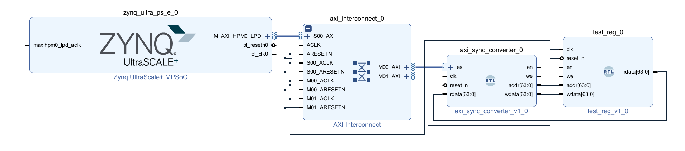

# AXI to SyncReg Converter

## Usage

- Generic converter from AXI4-Lite to synchronized register interface
- Master: AXI4-Lite
- Slave: BRAM style synchronized port
  - `en`: enable (only hold for 1 cycle)
  - `we`: write enable (only hold for 1 cycle)
  - `addr`: address to be accessed
  - `rdata`: data to be read (`rdata` is valid next cycle after `en`)
  - `wdata`: data to be written (changed next cycle after `we`)
- Hint:
  - `awaddr` is stored in register. Other AXI signals are just wires. Use registers if necessary.
  - `en && we && addr == <address> && wdata == <value>` can be used as trigger to activate modules.

## Testbench Usage

Vivado:
- Add the design and testbench files
- Create a block design like this:

- Simulate

## TODO

- Parameterize address and data width
- Parameterize access latency (after `en` or `we`)
